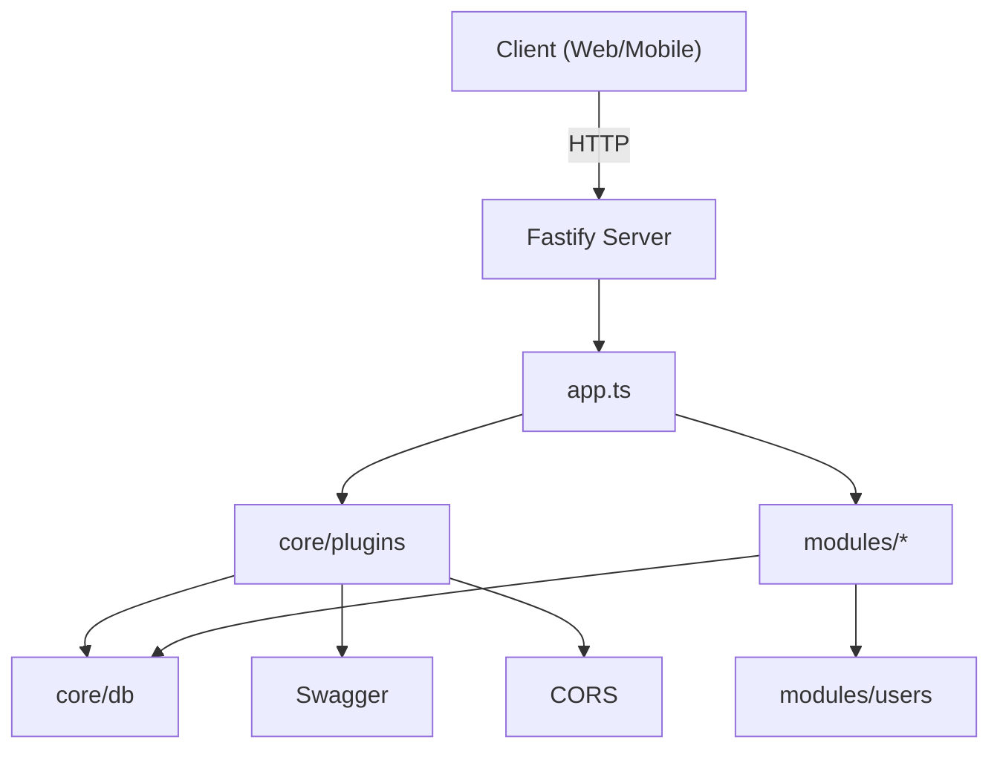

# NovaFast Pattern - Guía de Arquitectura

## 1. Objetivo
NOVACORE es una plantilla y guía para construir APIs REST con Fastify usando una arquitectura modular equilibrada entre rapidez y mantenibilidad. Está orientada a proyectos que usan bases de datos relacionales (PostgreSQL/MySQL) y requieren una estructura clara por dominios.


## 2. Filosofía
- **Modularidad por dominio:** cada módulo encapsula rutas, controladores, servicios y modelos.
- **Pragmatismo:** suficiente rigor arquitectónico para escalar, sin sobreingeniería.
- **Flexibilidad:** plugins y módulos opcionales (ej. auth) que se pueden activar según el proyecto.


## 3. Estructura de carpetas
```
src/
 ├── core/         → Config, DB, plugins
 ├── modules/      → Módulos del dominio (users, missions, ...)
 ├── shared/       → Utilidades y tipos comunes
 ├── app.ts        → Registro central de plugins y módulos
 └── server.ts     → Entrada del servidor
```


## 4. Flujo de ejecución
1. `server.ts` arranca y crea la instancia Fastify.
2. `app.ts` registra plugins y módulos.
3. Petición → `routes` → `controller` → `service` → `model` → DB


## 5. Patrones Base e Inspiraciones
A continuación se describen los patrones arquitectónicos y de diseño que inspiraron NovaFast Pattern, y por qué se eligieron.

### 5.1 Patrones Arquitectónicos

#### Clean Architecture
- **Motivo:** Separación clara entre lógica de negocio y detalles de infraestructura. Permite cambiar la base de datos o el framework sin tocar el dominio.
- **Por qué lo escogimos:** Mantener el núcleo del dominio independiente de frameworks y detalles técnicos reduce el coste de cambios a largo plazo (por ejemplo migrar de Postgres a otro motor o reemplazar Fastify por otro framework). También mejora la testabilidad porque el negocio puede probarse con dobles (mocks/stubs) sin necesidad de infraestructura.
- **Aplicación en NovaFast:** Los módulos contienen lógica (services) separada de la infraestructura (core/plugins, core/db). Esto facilita testeo y migraciones.

#### Modular Monolith
- **Motivo:** Mantener la comodidad de un monolito (despliegue simple) con modularidad que facilite la evolución a microservicios si es necesario.
- **Por qué lo escogimos:** Ofrece un balance entre simplicidad operativa y separación de responsabilidades: despliegues simples y baja latencia entre módulos, mientras que cada módulo permanece lo suficientemente desacoplado para extraerse en el futuro.
- **Aplicación en NovaFast:** Cada módulo es autónomo y puede extraerse a un microservicio cuando se requiera.

#### MVC (inspiracional)
- **Motivo:** Organización conceptual entre modelos, vistas (API responses) y controladores.
- **Por qué lo escogimos:** Aunque no se renderizan vistas HTML, el patrón MVC aporta disciplina para separar la capa HTTP (controllers), la lógica de negocio (services) y la forma de los datos (models). Esto mejora legibilidad y facilita localizar responsabilidades.
- **Aplicación en NovaFast:** Aunque no hay "views" tradicionales, la separación entre `models`, `controllers` y `services` sigue la idea de MVC para claridad.


### 5.2 Patrones de Diseño de Software

#### Repository Pattern
- **Motivo:** Aislar acceso a datos para facilitar cambios de tecnología y testing.
- **Por qué lo escogimos:** Centralizar las consultas y operaciones sobre la persistencia en una capa permite cambiar la estrategia de acceso a datos (ORM, queries SQL o servicios remotos) sin afectar la lógica de negocio. También facilita pruebas unitarias con implementaciones simuladas.
- **Aplicación:** Recomienda crear una capa/repository en cada módulo que encapsule consultas SQL o llamadas al ORM.

#### Dependency Injection
- **Motivo:** Facilitar swapping de implementaciones y testing.
- **Por qué lo escogimos:** Inyectar dependencias (DB, logger, clients) evita acoplamientos fuertes y facilita sustituir implementaciones para pruebas o entornos distintos. Favorece también la composición de la aplicación desde `app.ts`.
- **Aplicación:** Fastify `decorate` y `register` funcionan como puntos para inyectar dependencias (DB, logger), y el patrón recomienda usar estos mecanismos.

#### Factory Pattern
- **Motivo:** Centralizar creación de objetos complejos (conexiones DB configuradas, clientes externos).
- **Por qué lo escogimos:** Al tener fábricas para crear recursos configurados (por entorno), se reduce la duplicación y se simplifica la inicialización y configuración centralizada de recursos costosos o con dependencias.
- **Aplicación:** Los plugins en `core/plugins` actúan como factorías configurables para recursos como DB o clients externos.

#### Strategy Pattern
- **Motivo:** Permitir múltiples algoritmos o estrategias (ej. distintos métodos de autenticación).
- **Por qué lo escogimos:** Algunos comportamientos (p.ej. políticas de autorización, almacenamiento, hashing) pueden requerir varias implementaciones intercambiables; la estrategia permite seleccionarlas sin cambiar el consumidor.
- **Aplicación:** Útil en módulos como `auth/` o `payments/` donde puedes intercambiar estrategias.

#### Plugin Pattern
- **Motivo:** Encapsular funcionalidades reutilizables que se registran en el servidor.
- **Por qué lo escogimos:** Fastify está diseñado alrededor de plugins: usar este patrón permite componer capacidades (CORS, Swagger, DB, auth) de forma reutilizable y parametrizable.
- **Aplicación:** Uso intensivo de plugins para CORS, Swagger, auth y otros.


## 6. Decisiones de diseño y por qué

### Elección de Fastify
- **Por qué:** alto rendimiento, sistema de plugins y buen soporte TypeScript.

### TypeScript como lenguaje base
- **Por qué:** seguridad de tipos, autocompletado y menor cantidad de bugs en proyectos medianos a grandes.

### Modular por dominio
- **Por qué:** facilita escalar funcionalidades, hace el código más legible y facilita que múltiples desarrolladores trabajen en paralelo.

### Autenticación como plugin opcional
- **Por qué:** no todas las apps necesitan auth; mantenerlo opcional reduce overhead en proyectos simples.


## 7. Diagrama arquitectónico (Mermaid)




## 8. Buenas prácticas
- No acceder a la DB desde controllers.
- Mantener controllers delgados.
- Evidenciar rutas con `prefix` por módulo.
- Centralizar configuración en `core/config`.
- Documenta cada nuevo módulo en `ARCHITECTURE.md`.


## 9. Migración a microservicios
- Extraer un módulo completo (controller, service, model, routes) y convertirlo en un repo/servicio independiente.
- Usar eventos o HTTP entre servicios según necesidad.


## 10. Ejemplo rápido: crear un nuevo módulo
1. Crear carpeta `src/modules/<name>`.
2. Añadir `<name>.model.ts`, `<name>.service.ts`, `<name>.controller.ts`, `<name>.routes.ts`, `index.ts`.
3. Registrar en `app.ts`: `app.register(import('./modules/<name>/index.js'), { prefix: '/api/<name>' })`.


## 11. Ventajas, limitaciones y extensiones

### ¿En qué es bueno este patrón?
- Permite arrancar proyectos rápidamente con una estructura repetible y predecible.
- Fomenta modularidad por dominio: facilita que varios equipos trabajen en paralelo y que los módulos se extraigan en el futuro.
- Mejora la testabilidad: la separación entre controllers, services y repositorios hace sencillo mockear dependencias.
- Buena compatibilidad con Fastify: el patrón encaja con el modelo de plugins y registro de Fastify.
- Balance razonable entre simplicidad y escalabilidad para aplicaciones backend de tamaño pequeño a mediano.

### ¿En qué no es ideal?
- No es la mejor opción para aplicaciones extremadamente simples (un script o micro-API trivial), donde la sobrecarga de carpetas y capas añade fricción.
- Para sistemas con requisitos de latencia ultra-bajos y escalado extremo, un monolito modular puede necesitar readaptación a microservicios o arquitecturas orientadas a eventos más avanzadas.
- Si no se aplican y mantienen límites de responsabilidad claros, la modularidad puede convertirse en acoplamiento implícito (mala práctica: copiar/pegar lógica entre módulos).
- No resuelve por sí sola aspectos operativos (deployment, observabilidad, secrets management) — hay que complementarla.

### Qué se le puede agregar (extensiones recomendadas)
- Autenticación/ autorización como plugin opcional (JWT, OAuth2, RBAC).
- Observabilidad: métricas (Prometheus), traces distribuidos (OpenTelemetry) y logging estructurado.
- Caching: una capa opcional de cache (Redis) en servicios que lo requieran.
- Rate limiting y protección (shielding) a nivel de plugin.
- Circuit breakers / retries cuando se integren servicios externos.
- Job queue / background workers para tareas asíncronas (BullMQ / RabbitMQ).
- Feature flags y configuración dinámica (LaunchDarkly, Unleash, o soluciones caseras).
- CI/CD y pipelines: flujos automáticos para lint/test/build/release.
- Infraestructura como código (Terraform, Pulumi) y manifestos de despliegue (K8s Helm charts) si se va a producción.

Estas extensiones permiten adaptar la plantilla a proyectos con mayores necesidades de resiliencia, observabilidad y operaciones.


## 11. Licencia y créditos
Creado por Juan Diego Robles - NOVACORE (2025)